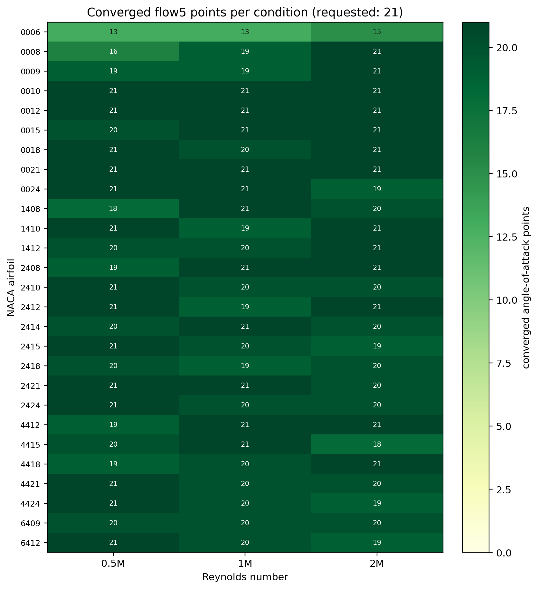
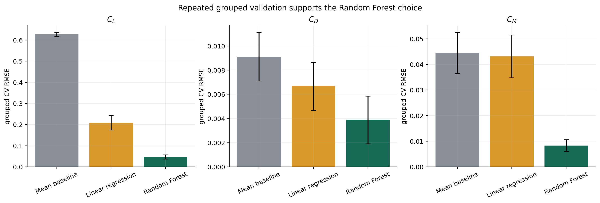
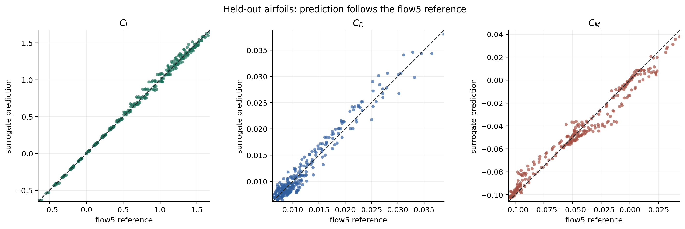

# AeroSurrogate

AeroSurrogate is an installable research package that turns flow5 airfoil
polar exports into a validated, reusable Random Forest surrogate. It predicts
lift, drag, and pitching-moment coefficients for NACA 4-digit geometries while
recording the data, software, and model provenance needed to reproduce the
result.

> **Scientific boundary:** AeroSurrogate approximates flow5 v7.57 outputs. It
> is not validated against wind-tunnel measurements or high-fidelity CFD and
> must not be treated as an extrapolating physical model.

## Research Question

How accurately can a Random Forest approximate flow5 aerodynamic coefficients
for previously unseen NACA 4-digit airfoils, and how can the complete workflow
be made reproducible and reusable?

## Evidence At A Glance

- 27 NACA 4-digit airfoils
- Reynolds numbers 500,000, 1,000,000, and 2,000,000
- requested angle-of-attack range from -6 to 14 degrees
- 1,618 converged flow5 operating points
- 83 unconverged requested points retained as missing
- complete airfoils held out during validation
- 3 repeats of 5-fold grouped cross-validation
- mean and linear baselines evaluated on identical folds
- raw-data, processed-data, and model checksums recorded



The coverage figure makes missing flow5 points explicit. No synthetic target
values are introduced.

## Heterogeneous Workflow

```text
NACA geometry + flow5 XML configuration
                  |
                  v
        flow5 polar analyses
                  |
                  v
      81 TXT exports and logs
                  |
                  v
Python import -> integrity checks -> grouped validation
                  |
                  v
Random Forest + baselines -> metrics + figures
                  |
                  v
deployment model -> CLI / Python API / HTML dashboard
```

flow5 produces the aerodynamic reference values. Python imports and validates
the exports, evaluates model generalization, trains the deployment model, and
serves predictions. The reproducible Python stages can be orchestrated with
the included `workflow/Snakefile`; flow5 execution remains an external,
documented step.

## Model Inputs And Outputs

The static, deterministic, forward surrogate maps

```text
(camber, camber position, thickness, angle of attack, Reynolds number)
                                  ->
                  (CL, CD, CM)
```

to:

- `CL`: lift coefficient
- `CD`: drag coefficient
- `CM`: pitching-moment coefficient

Random Forest was selected because the relationship is nonlinear and
multi-output. Repeated grouped validation now compares that choice against a
mean predictor and linear regression rather than relying on an unsupported
model preference.



## Validation

### Fixed Holdout For A Concrete Demonstration

The documented seed-42 holdout contains NACA 0021, 2418, 2424, 4415, and 4418.
None of their operating points appear in training.

| Target | RMSE | MAE | R2 |
| --- | ---: | ---: | ---: |
| CL | 0.03457 | 0.02306 | 0.99671 |
| CD | 0.00132 | 0.00107 | 0.95441 |
| CM | 0.00696 | 0.00486 | 0.96998 |



### Repeated Grouped Validation

Three repetitions of five grouped folds provide 15 distinct held-out-airfoil
evaluations per model.

| Model | CL mean RMSE | CD mean RMSE | CM mean RMSE |
| --- | ---: | ---: | ---: |
| Mean baseline | 0.62735 | 0.00911 | 0.04449 |
| Linear regression | 0.20865 | 0.00666 | 0.04314 |
| Random Forest | **0.04657** | **0.00388** | **0.00830** |

The Random Forest is clearly better on average, but fold variability remains
important—especially for drag. The recorded 95% confidence-interval
half-widths for Random Forest RMSE are 0.00516 for CL, 0.000995 for CD, and
0.00116 for CM. These intervals measure sensitivity to held-out airfoil
selection; they are not experimental or epistemic uncertainty.

Residual and per-airfoil diagnostics are stored in
`runs/final_grouped_cv_naca_seed42/reports/figures/`.

## Installation

```bash
python3 -m venv .venv
source .venv/bin/activate
pip install -e ".[dev]"
```

For a user installation:

```bash
pip install .
```

The built wheel contains the deployment model, model-ready example dataset, and
self-contained dashboard. A clean installation can therefore predict without
the repository:

```bash
aero-surrogate predict \
  --naca 2412 \
  --alpha-deg 4 \
  --reynolds 1000000
```

Python API:

```python
from aero_surrogate import AeroSurrogate

surrogate = AeroSurrogate.load()
prediction = surrogate.predict_naca(
    "2412",
    alpha_deg=4,
    reynolds=1_000_000,
)
print(prediction)
```

Predictions outside the observed training feature ranges emit an
`OutOfDomainWarning`. Returning a number does not make extrapolation
scientifically valid.

Export the installed dashboard:

```bash
aero-surrogate export-bundled-dashboard \
  --output aerosurrogate_dashboard.html
```

## Reproduce The Dataset

The final flow5 inputs, projects, polar exports, and logs are retained under
`data/raw/`.

```bash
aero-surrogate import-flow5 \
  --directory data/raw/flow5_exports_multi_re \
  --metadata data/raw/flow5_exports_multi_re/metadata.csv \
  --output data/processed/flow5_airfoils.csv
```

Dataset validation rejects missing or infinite numerical values, duplicate
operating points, empty identifiers, negative drag, and values outside broad
physical plausibility ranges.

## Reproduce Validation, Training, And Figures

```bash
aero-surrogate run \
  --data data/processed/flow5_airfoils.csv \
  --raw-dir data/raw \
  --run-id final_grouped_cv_naca_seed42 \
  --deployment-model models/flow5_random_forest.pkl \
  --cv-splits 5 \
  --cv-repeats 3
```

Or run all Python stages with Snakemake:

```bash
snakemake -s workflow/Snakefile --cores 1
```

The final run contains configuration, environment metadata, input checksums,
logs, fixed-holdout metrics, fold-level cross-validation metrics, baseline
comparisons, predictions, scientific figures, and separate validation and
deployment models.

## Verification And Software Quality

```bash
ruff check src tests
pytest --cov=aero_surrogate --cov-fail-under=75
python -m build
```

The current suite contains 20 unit and integration tests with 89% coverage.
GitHub Actions tests Python 3.10 and 3.12, builds the distribution, installs the
wheel into a clean environment, makes a bundled-model prediction, and exports
the bundled dashboard.

## Reproducibility And FAIR

- raw, processed, and model artifacts have SHA-256 checksums
- the run records the Git commit, Python version, platform, and package versions
- `environment-lock.yml` records the exact final development environment
- software is MIT licensed
- citation metadata is supplied in `CITATION.cff` and `codemeta.json`
- CSV, JSON, TXT, XML, DAT, HTML, and PNG are used for portable exchange
- model pickle files must only be loaded from trusted sources

The repository does not yet have a DOI or independent archival deposit. A
Zenodo archive is recommended for the final public release.

See:

- [Scientific validation](docs/scientific_validation.md)
- [Reproducibility and FAIR checklist](docs/reproducibility_and_fair.md)
- [Data management plan](docs/data_management_plan.md)
- [API guide](docs/api.md)
- [Workflow guide](docs/workflow.md)
- [Security policy](SECURITY.md)

## Limitations

- reference values are flow5 outputs, not experimental truth
- geometry is limited to the NACA 4-digit parameterization
- Reynolds number is sampled at only three levels
- flow5 convergence varies across operating conditions
- Random Forest predictions are piecewise and unsafe outside the data domain
- repeated folds quantify split sensitivity, not predictive uncertainty
- flow5 execution is documented but not fully automated inside Python

## License And Citation

The package is released under the MIT License. Please cite the project using
`CITATION.cff`.
